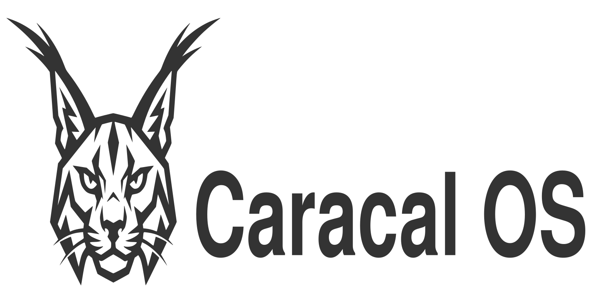

[](https://app.codacy.com/gh/caracal-dev/caracal/dashboard?utm_source=gh&utm_medium=referral&utm_content=&utm_campaign=Badge_grade)[](https://github.com/caracal-dev/caracal/actions/workflows/build.yml)[](https://github.com/caracal-dev/caracal/actions/workflows/build-disk.yml)[](https://deepwiki.com/caracal-dev/caracal)

<picture>
  <source media="(prefers-color-scheme: dark)" srcset="assets/images/caracal-banner-dark.png">
  <source media="(prefers-color-scheme: light)" srcset="assets/images/caracal-banner-light.png">
  
</picture>

A custom [bootc](https://github.com/bootc-dev/bootc) image built on Fedora Kinoite (KDE Plasma), tuned from the ground up for audio production. Caracal-OS delivers a fast, immutable Linux desktop with a lean core production stack ready on first boot, while the larger DAW, plugin, instrument, and utility catalog is handled by the bundled Caracal Software Installer.

---

## What's Inside

### Performance

- **Bazzite kernel** — replaces the stock Fedora kernel with Bazzite's pre-built OCI kernel image
- **CPU governor** — defaults to `performance` mode through `cpupower`, with a Caracal service fallback that reapplies the governor and CPU energy preference for low-latency DAWs
- **Realtime/memlock limits** — `@audio` and `@realtime` groups preconfigured with `rtprio 95` and unlimited memlock through both PAM and `systemd`
- Preconfigured Wine/Yabridge compatibility for using Windows VST plugins

### Core DAWs (included)

| DAW | Notes |
|-----|-------|
| Ardour 9 | Full-featured professional DAW |
| Qtractor | MIDI/audio sequencer |
| Carla | Plugin host / patchbay |

**Also included in the base image:**

- Hydrogen
- QjackCtl
- Yabridge, Wine TKG, and Winetricks for Windows VST workflows

**Optional DAWs** (install after first boot via `ujust`):

```
ujust install-reaper
ujust install-renoise
ujust install-bitwig
ujust uninstall-reaper
ujust uninstall-renoise
ujust uninstall-bitwig
```

For the broader optional catalog, launch the bundled Caracal Software Installer from the app launcher, or open the terminal UI with:

```bash
ujust software-installer
```

### Plugins & Instruments

Caracal now keeps the image smaller by preinstalling a focused plugin set and moving the larger plugin library into the Software Installer. Installer-managed plugins are installed in the user's home plugin folders where possible, so they survive image updates cleanly without rpm layering.

**Included out of the box:**

- LSP Plugins (`lsp-plugins-vst`, `lsp-plugins-clap`, `lsp-plugins-lv2`)
- Calf
- Guitarix
- Vitalium (Vital without the online stuff)
- DISTRHO DrumSynth
- DISTRHO EQuinox
- Carla LV2 integration

### Caracal Software Installer

The Caracal Software Installer is the main way to expand the system after first boot. It provides a curated audio catalog with a desktop GUI, terminal UI, and CLI helpers, so Caracal can stay lean while still making common music-production installs easy.

It can install and uninstall software across categories, queue multiple selections in one run, detect already-installed entries, and use the right install path for the package: `/opt` or `/usr/local` for system apps when needed, and user-local plugin folders such as `~/.vst3`, `~/.clap`, and `~/.lv2` for plugins that do not need system integration.

**Optional installs available through Caracal Software Installer include:**

- DAWs: REAPER, Renoise, Bitwig Studio, Mixbus, Zrythm, Helio, Stargate
- Instruments: Cardinal, VCV Rack 2, Surge XT, Decent Sampler, SunVox, Virtual ANS, Dexed, Loopino, Odin2, OB-Xf, TAL-Noisemaker, Wavetable, Yoshimi
- Effects: Dragonfly Reverb, BYOD, Neural Amp Modeler, AIDA-X, Audio Assault plugins, ChowDSP plugins, Zam Plugin Suite, DPF plugins, TAL plugins
- Utilities: MuseScore Studio, BambooTracker, MilkyTracker, Declick, RTCQS

**Windows VST support:**

- Wine TKG + Yabridge — run Windows VST2/VST3 plugins natively inside Linux DAWs

### Getting More Plugins

If you are coming from Windows, the easiest path is:

1. Start with the Caracal Software Installer.
2. If what you want is not there yet, check [LinuxDAW.org](https://linuxdaw.org/), which is a useful Linux plugin catalog.
3. Download Linux plugin builds in formats like `VST3`, `CLAP`, or `LV2`.
4. Copy the downloaded plugin into your home plugin folders:
   - `~/.vst3`
   - `~/.clap`
   - `~/.lv2`
5. Re-scan plugins in your DAW or restart the DAW.

If those folders do not exist yet, you might not have run the 'ujust first-run' step. To set this up, open Ghostty and run 'ujust first-run'. On Linux, folders that start with a `.` are hidden by default, so in a file manager you may need to enable "Show Hidden Files" first. You can do this by pressing Ctrl+H while in the Home directory.

### Audio Stack

- JACK (`jack-audio-connection-kit`, `qjackctl`, `ffado` for FireWire interfaces)
- PipeWire + ALSA bridge (`pipewire-alsa`, `pavucontrol`)
- Core audio workflow tools aimed at low-latency Linux production

### Shell & Tooling

- Zsh, Neovim, Ghostty, 7zip, Distrobox, Zenity
- Oh My Zsh setup through `ujust first-run`
- Homebrew-managed shell extras through `ujust first-run`: `atuin`, `eza`, `ugrep`, `zoxide`, and `bash-preexec`

---

## Installation

### Prerequisites

- A machine running any bootc-compatible image (Bazzite, Bluefin, Aurora, or plain Fedora Atomic)
- A GitHub account (to pull the published image from GHCR)

### Switch to Caracal-OS

```bash
sudo bootc switch ghcr.io/caracal-dev/caracal:latest
```

For NVIDIA systems using Turing or newer GPUs, switch to the NVIDIA image instead:

```bash
sudo bootc switch ghcr.io/caracal-dev/caracal-nvidia:latest
```

Reboot to apply. On first login, run the guided setup:

```bash
ujust first-run
```

That recipe adds you to the `audio` and `realtime` groups, installs the shell extras, and sets up yabridge.

Or do the group step manually:

```bash
sudo usermod -aG audio,realtime $USER
```

Then reboot, or at minimum log out and back in, so the new group membership and session limits take effect.

---

## Building Locally

Requires [just](https://just.systems/) and Podman.

```bash
# Build the container image
just build

# Build a bootable QCOW2 (for testing in a VM)
just build-qcow2

# Run in a VM
just run-vm-qcow2
```

See the [Justfile](./Justfile) for all available recipes.

---

## Contributing

Contributions are welcome and strongly encouraged.

Caracal is trying to cover a wide surface area: audio production workflows, realtime tuning, plugin compatibility, desktop integration, bootc/Fedora Atomic image building, and hardware-specific behavior across laptops, desktops, audio interfaces, GPUs, MIDI devices, and controllers. That is too much for one person to validate alone, so more contributors directly improves the project.

If you use Caracal and find a bug, regression, packaging issue, compatibility problem, or workflow rough edge, please open an issue. If you already know the fix, open a pull request.

Helpful contribution areas include:

- Testing on different hardware: laptops, desktops, AMD/NVIDIA/Intel graphics, USB audio interfaces, MIDI controllers, and unusual audio chipsets
- Verifying DAW and plugin compatibility across Ardour, Carla, Qtractor, REAPER, Renoise, Bitwig, Wine, and yabridge
- Improving the base image, installer, branding, first-run flow, and desktop integration
- Fixing packaging and build issues in the image, installer scripts, and `ujust` recipes
- Improving documentation for setup, troubleshooting, plugin paths, hardware quirks, and known-good workflows

Suggested contribution flow:

1. Fork the repo and create a branch for your change.
2. Build locally with `just build`, or use `just build-qcow2` if you want to test in a VM.
3. Make the smallest focused change you can.
4. Include clear reproduction steps, hardware details, logs, or screenshots when reporting or fixing a bug.
5. Open a pull request with a concise summary of what changed and how you tested it.

When filing compatibility reports, the most useful details are:

- Hardware model and CPU/GPU
- Audio interface or MIDI device
- Whether the issue is on bare metal or in a VM
- What DAW, plugin, or workflow was involved
- Exact steps to reproduce
- Relevant logs, terminal output, or screenshots

Even small contributions help. A tested fix, a better doc note, a hardware report, or a reproducible bug report all reduce the amount of guesswork and make Caracal more reliable for everyone.

---

## Bug Reports & Feature Requests

If you hit a bug, open a [GitHub issue](https://github.com/caracal-dev/caracal/issues/new/choose).

For bug reports, please include:

- What happened
- What you expected to happen
- Exact steps to reproduce it
- Your hardware model, CPU, GPU, and audio interface
- Whether the issue is on bare metal or in a VM
- Which DAW, plugin, or device was involved
- Logs, screenshots, or terminal output if you have them

If you want a new feature, improvement, or package added, open a [feature request](https://github.com/caracal-dev/caracal/issues/new/choose) and explain:

- The workflow or problem you are trying to solve
- Who the change helps
- What you want Caracal to do differently
- Whether there is an existing Linux package, plugin, or project we should integrate
- Any tradeoffs, risks, or compatibility concerns you already know about


---

## Image Verification

All published images are signed with [cosign](https://github.com/sigstore/cosign). Verify with:

```bash
cosign verify --key cosign.pub ghcr.io/caracal-dev/caracal:latest
```

---

## Based On

- [Fedora Kinoite](https://fedoraproject.org/kinoite/) — KDE Plasma on Fedora Atomic
- [Universal Blue image-template](https://github.com/ublue-os/image-template)
- [Bazzite kernel](https://github.com/bazzite-org/kernel-bazzite)

## Special Thanks to:
- Fedora Kinoite - The base this image is built on
- Universal Blue - for making this type of project possible
- [Bazzite](https://github.com/ublue-os/bazzite) - for the many performance enhancements
- [Secureblue](https://github.com/secureblue/secureblue) - for some security improvement ideas
- [Zirconium](https://github.com/zirconium-dev/zirconium) - excellent learning source
- [Zena](https://github.com/zena-linux/zena) for providing an example of CachyOS kernel implementation
